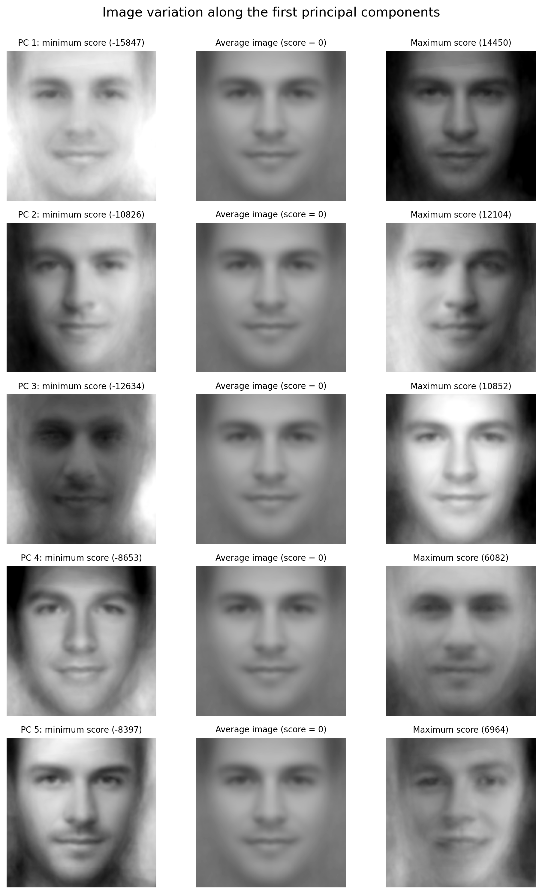
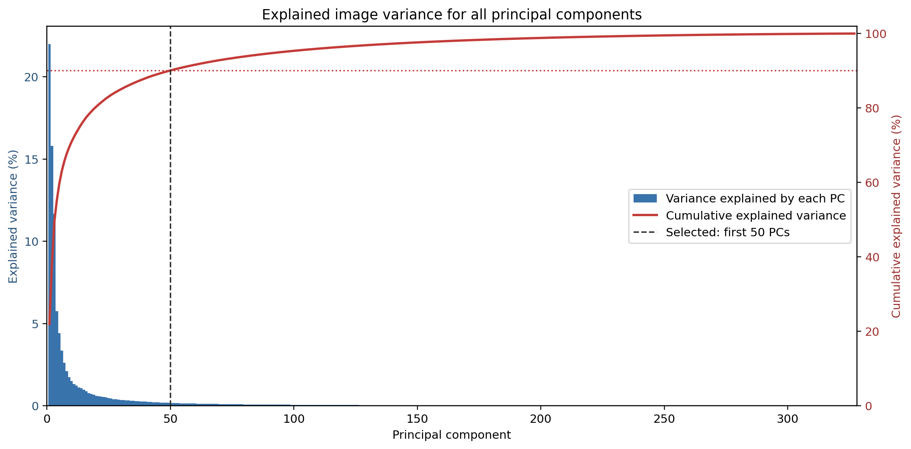

# Opgave 3 – PCA og dimensionsreduktion

De 328 gråtonebilleder blev repræsenteret som en matrix med ét billede pr. række og
40.000 pixelintensiteter pr. billede. Før PCA blev gennemsnitsbilledet trukket fra
hvert billede. Pixelværdierne blev **ikke** divideret med deres standardafvigelser.
PCA blev beregnet med singular value decomposition (SVD) på den centrerede
billedmatrix. Derved er scoren for et billede dets projektion på hver principal
component (PC), og disse scores kan bruges som predictors i den lineære
encoding-model.

**Figur 1.** Visualisering af de første fem PC'er. For hver PC viser venstre billede
gennemsnitsansigtet plus komponenten vægtet med den mindste observerede score,
midten viser gennemsnitsansigtet (score 0), og højre viser gennemsnitsansigtet plus
komponenten vægtet med den største observerede score. Pixelværdier uden for det
visbare interval 0–255 er kun klippet ved visualiseringen.

PC1 (21,98 % af variansen) beskriver især global lysstyrke og kontrast: den ene ende
er meget lys, mens den anden har et mørkere ansigt og en mørkere baggrund. PC2
(15,81 %) beskriver primært lysets retning fra side til side. PC3 (11,67 %) ændrer
fordelingen af lys mellem ansigtets centrum og periferien og indeholder også
variation i hår og ansigtskontur. PC4 (5,76 %) ser især ud til at ændre hovedets
bredde/form samt kontrasten omkring hår, øjne og næse. PC5 (4,42 %) indeholder
variation omkring kæbe, skæg, øjenbryn og mund og dermed også et svagt bidrag fra
ansigtsudtryk. Fortegnene på PC'erne er vilkårlige; det er forskellen mellem de to
ender, der kan fortolkes.

Da rating-opgaven omhandler attraktivitet, kan ansigtsform, kæbe, symmetri,
behåring og udtryk i PC4–PC5 være relevante. De dominerende ændringer i PC1–PC3 er
derimod i høj grad belysning, eksponering og baggrund. De kan påvirke den oplevede
attraktivitet, men er hovedsageligt nuisance-variation snarere end egentlige
ansigtstræk. PCA maksimerer billedvarians uden at kende ratings og garanterer derfor
ikke, at de første komponenter er de bedste predictors for attraktivitet.

**Figur 2.** Den forklarede varians for alle 327 ikke-nul PC'er (søjler) og den
kumulative forklarede varians (rød kurve). Den sidste mulige komponent er nul efter
centrering og er derfor udeladt. Den stiplede lodrette linje viser det valgte cut-off.

De første fem PC'er forklarer tilsammen 59,64 % af variansen. Som en reproducerbar,
usuperviseret første reduktion blev det mindste antal komponenter, der forklarer
mindst 90 % af den samlede varians, valgt. Grænsen nås med de første 50 PC'er, som
forklarer 90,09 %. Dermed reduceres repræsentationen fra 40.000 pixelvariable til 50
kandidat-predictors. Alle billedernes PC-scores blev gemt med filnavn, så de kan
kobles entydigt til ratings. I opgave 4 anvendes forward selection med
krydsvalidering på disse 50 kandidater; 90 %-grænsen er altså en første
dimensionsreduktion, ikke en påstand om, at alle 50 PC'er skal indgå i den endelige
lineære model.
